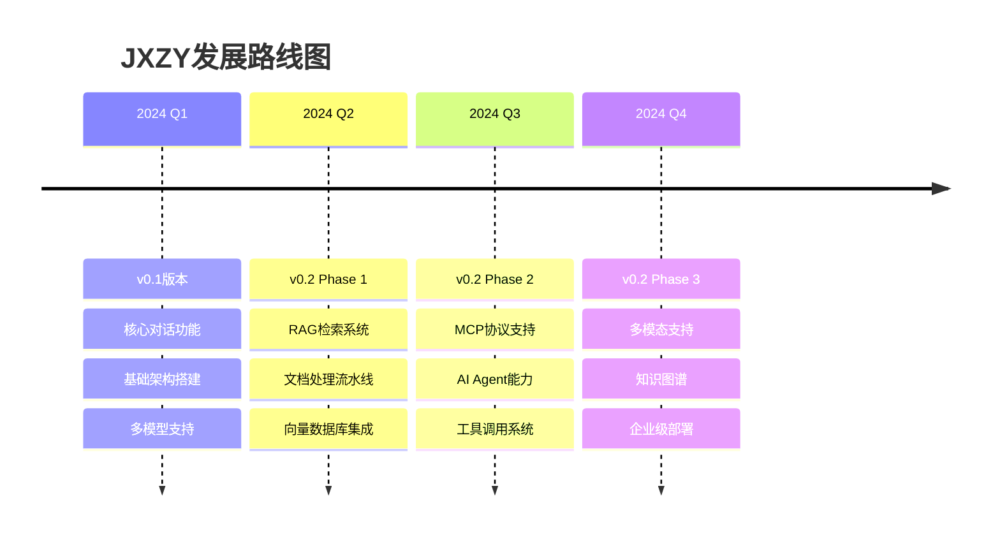

# JXZY AI应用服务

基于Go-Zero微服务框架构建的AI应用服务，采用三层微服务架构。从v0.1的核心对话功能到v0.2的完整AI agent平台，逐步演进。

## 📋 项目概述

JXZY是一个现代化的AI应用微服务平台，致力于提供高性能、可扩展的AI服务能力。项目采用版本化开发策略，每个版本都有明确的功能边界和技术目标。

## 🗂️ 版本文档

### 📚 [v0.1版本 - 核心对话服务](./docs/v0.1/README.md)
**当前版本** | 专注于智能对话的基础功能

- 🤖 智能对话基于豆包大模型
- 💬 会话上下文管理
- 🚀 流式响应输出
- 🏗️ 简化三层架构：Gateway → Context-RPC → LLM-RPC

### 🚀 [v0.2版本 - AI Agent平台](./docs/v0.2/README.md)
**规划中** | 扩展为完整的AI agent服务平台

- 📚 RAG检索和知识管理
- 🔌 MCP协议支持
- 🧠 AI Agent多步推理
- 🌐 完整三层架构：Gateway → Context-RPC → {LLM-RPC, RAG-RPC, MCP-RPC}

## 🏗️ 技术架构

### 核心设计原则
- **分层解耦**: 三层微服务架构，职责清晰
- **渐进演进**: 版本化开发，逐步增强功能
- **高性能**: 支持高并发和低延迟响应
- **可扩展**: 模块化设计，易于水平扩展

### 技术栈
- **框架**: Go-Zero微服务框架
- **语言**: Go 1.19+
- **数据库**: MySQL 8.0+, Redis 6.0+
- **消息队列**: Kafka (v0.2+)
- **向量数据库**: Milvus/Qdrant (v0.2+)

## 📈 路线图



## 🚀 快速开始

### 环境要求
- Go 1.19+
- MySQL 8.0+
- Redis 6.0+

### 启动服务 (v0.1)
```bash
# 克隆项目
git clone https://github.com/your-org/jxzy.git
cd jxzy

# 启动数据库和缓存
docker-compose up -d mysql redis

# 启动微服务
make start-all
```

详细启动说明请参考对应版本文档。

## 📊 项目结构

```
jxzy/
├── apis/           # Gateway API层
├── blls/           # Business Logic Layer
├── bs/             # Basic Service Layer
├── common/         # 公共组件
├── docs/           # 版本文档
│   ├── v0.1/      # v0.1版本文档
│   └── v0.2/      # v0.2版本文档
├── scripts/        # 部署脚本
└── monitor/        # 监控配置
```

## 🤝 贡献指南

我们欢迎社区贡献！请遵循以下步骤：

1. Fork 项目
2. 创建功能分支 (`git checkout -b feature/AmazingFeature`)
3. 提交更改 (`git commit -m 'Add some AmazingFeature'`)
4. 推送到分支 (`git push origin feature/AmazingFeature`)
5. 打开 Pull Request

## 📄 许可证

本项目采用 MIT 许可证 - 查看 [LICENSE](LICENSE) 文件了解详情。

## 📞 联系我们

- 项目首页: [GitHub Repository](https://github.com/your-org/jxzy)
- 问题反馈: [Issues](https://github.com/your-org/jxzy/issues)
- 讨论交流: [Discussions](https://github.com/your-org/jxzy/discussions)

